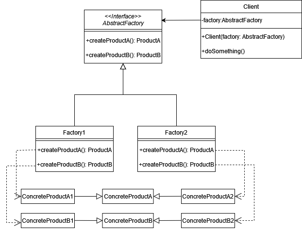
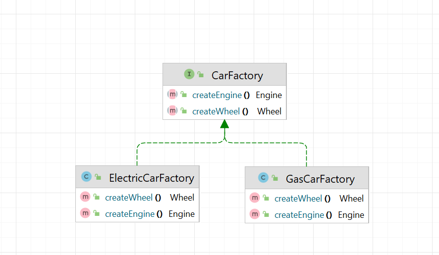
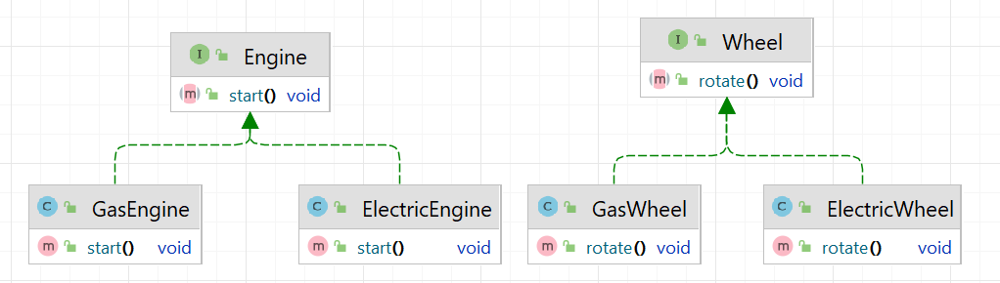

# Абстрактная фабрика (Abstract factory)

**Абстрактная фабрика** - это порождающий шаблон проектирования, который позволяет создавать наборы связанных объектов
без привязки к конкретным классам.

Стандартная реализация шаблона включает в себя:

1. Создать интерфейс или абстрактный класс, который будет представлять фабрику для создания объектов определенного
   семейства. Также необходимо определить методы, которые будут использоваться для создания различных продуктов.
2. Создать интерфейсы или абстрактные классы для каждого типа продуктов, которые будут создаваться фабрикой.
3. Создать классы, которые будут реализовывать абстрактную фабрику, создавая конкретные продукты.
4. Создать классы, которые реализуют абстрактные продукты, определенные ранее. Эти классы будут создаваться конкретными
   фабриками.

В общем случае диаграмма выглядит таким образом:

## Абстрактная фабрика в Java

В JDBC, чтобы взаимодействовать с различными базами данных, используется интерфейс
_DriverManager_, который является фабрикой для получения объектов Connection. Этот подход позволяет работать с разными
СУБД, не привязываясь к конкретной реализации. Фабрики JDBC создают объекты _Connection_, _Statement_, _
PreparedStatement_, которые представляют семейство связанных объектов.

## Описание нашего примера

В нашем примере мы рассмотрим фабрику, которая будет производить запчасти автомобилей. У нас будет два типа автомобилей:
обычный и электрический. Каждый из этих типов автомобилей будет требовать свой набор компонентов

**Итоговая диаграмма классов:**

