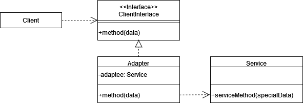
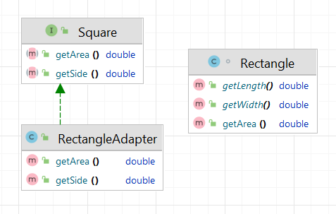

# Адаптер (Adapter, Wrapper)

**Адаптер** - это структурный паттерн, который позволяет взаимодействовать объектам с несовместимыми интерфейсами.

Стандартная реализация шаблона включает в себя:

1. **Определить интерфейс целевого класса**: Описать методы, которые должен поддерживать
   адаптированный класс.
2. **Создать Adaptee класс**: Определить методы и функциональность, которые должны
   быть адаптированы.
3. **Создать класс адаптера**: Этот класс должен имплементировать интерфейс целевого класса и содержать
   ссылку на объект адаптируемого класса.
4. **Реализовать методы интерфейса в классе адаптера**: В этих методах мы используем объекты или методы адаптируемого
   класса, чтобы выполнить нужные действия.

В общем виде диаграмма шаблона выглядит следующим образом:



## Адаптер в Java

В Collections Framework есть множество примеров Адаптера. Например, Arrays.asList() позволяет привести массив к списку,
предоставляя интерфейс List для дальнейшей работы с массивом.

## Адаптер классов

Существует реализация паттерна Адаптер в виде адаптера классов. В этом подходе используется наследование адаптера от целевого и адаптируемого класса.
В java такой подход не всегда возможен, потому что класс не может наследоваться от двух и более других классов.
Однако можно схитрить и использовать интерфейсы:

```java
interface Target {
    void request();
}

class Adaptee {
    public void specificRequest() {
        System.out.println("Adaptee's specific request.");
    }
}

class ClassAdapter extends Adaptee implements Target {
    public void request() {
        specificRequest();
    }
}
```

## Описание нашего примера

В нашем примере мы будем реализовывать адаптер объектов. 

**Итоговая диаграмма классов**:

