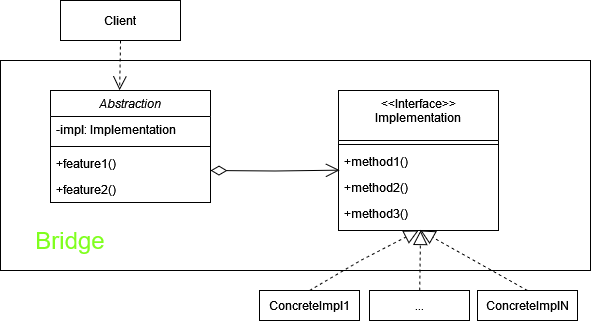
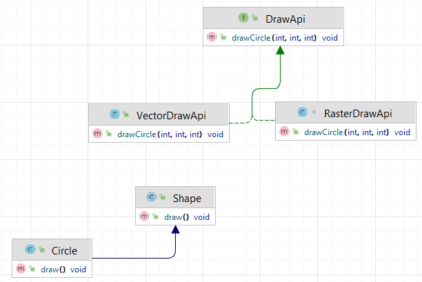

# Мост (Bridge)

**Мост** - это структурный паттерн, который разделяет классы на абстракцию и реализацию, что позволяет изменять их
независимо друг от друга.

Стандартная реализация шаблона включает в себя:

1. Создать интерфейс, который будет являться мостом между абстракцией и реализацией.
2. Создать абстрактный класс, который будет содержать ссылку на интерфейс и определять методы для работы с этим
   интерфейсом.
3. Создать конкретные классы, реализующие интерфейс, которые будут представлять различные реализации.
4. Создать конкретные классы, наследующие абстрактный класс и реализующие его методы, используя интерфейс.
5. В абстрактном классе мы должны использовать методы интерфейса для делегирования выполнения конкретных действий
   классам-реализациям.

В общем виде диаграмма шаблона выглядит следующим образом:

## Описание нашего примера

В нашем примере у нас есть абстракция Shape, которая может быть реализована разными способами, например, векторными или
растровыми графическими системами.

1. **DrawApi** - абстракция, определяющая интерфейс для использования различных реализаций.
2. **VectorDrawApi, RasterDrawApi** - конкретные реализации для векторной и растровой графики.
3. **Shape** - Абстракция формы, которая использует реализацию из DrawApi.
4. **Circle** - Конкретный класс формы.

**Итоговая диаграмма классов**:

