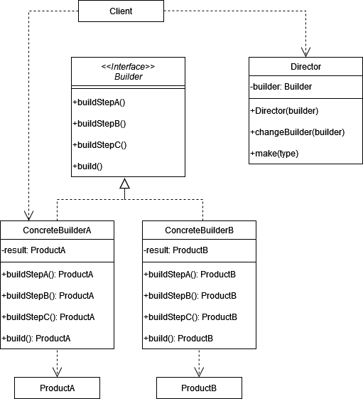
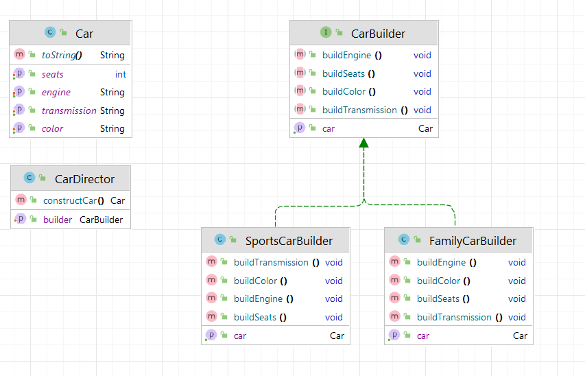

# Строитель (Builder)

**Строитель** - это порождающий шаблон проектирования, который позволяет создавать объекты пошагово.

Стандартная реализация шаблона включает в себя:

1. **Продукт (Product)**: Определить класс или структуру, представляющую создаваемый объект с необходимыми полями и
   методами.
2. **Интерфейс строителя (Builder Interface)**: Объявить методы, которые описывают этапы конструирования объекта.
3. **Конкретный строитель (Concrete Builder)**: Реализовать интерфейс строителя.
4. **Директор (Director)**: Реализовать класс, который управляет процессом создания объектов.

В общем виде диаграмма шаблона выглядит следующим образом:



## Строитель в Java

В стандартной библиотеке Java достаточно много примеров этого паттерна. Например, класс _StringBuilder_ или
_DateTimeFormatterBuilder_.
Также появившийся в Java 11 HttpClient использует Строителя для создания запроса или http-клиента:

```java
HttpClient client=HttpClient.newBuilder()
        .version(HttpClient.Version.HTTP_2)
        .connectTimeout(Duration.ofSeconds(10))
        .build();
```

## Простая реализация

Самая стандартная реализация шаблона заключается в создании класса с внутренним статическим классом _Builder_.
Этот _Builder_ позволяет гибко создавать объекты класса _Product_:

```java
class Product {
    private String name;
    private double price;

    private Product(Builder builder) {
        this.name = builder.name;
        this.price = builder.price;
    }

    public String getName() {
        return name;
    }

    public double getPrice() {
        return price;
    }

    public static class Builder {
        private String name;
        private int age;
        private double price;

        public Builder setName(String name) {
            this.name = name;
            return this;
        }

        public Builder setPrice(double price) {
            this.price = price;
            return this;
        }

        public Product build() {
            return new Product(this);
        }
    }
}
```

В этом примере много бойлерплейта. Вместо создания внутреннего статического класса можно использовать аннотацию
**@Builder** из **lombok**.

## Описание нашего примера

В нашем примере мы немного углубимся и реализуем паттерн в соответствии с приведённой вначале диаграммой, т.е.
с использованием Директора.

**Итоговая диаграмма классов**:

