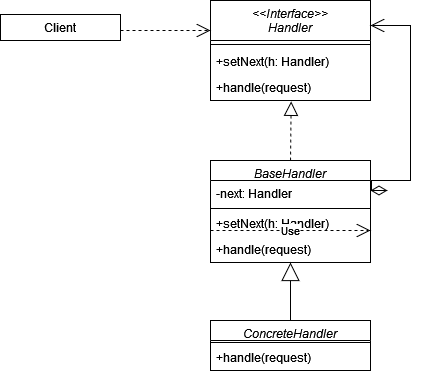
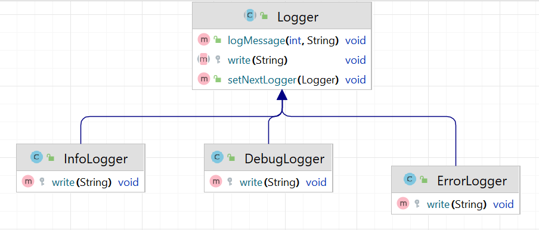

# Цепочка обязанностей (Chain of Responsibility)

**Цепочка обязанностей** - это поведенческий паттерн, который позволяет передавать запросы по цепочке обработчиков.
При таком подходе пайплайн обработки разбивается на отдельные классы, имплементирующие общий интерфейс. Поэтому у
каждого класса-обработчика появляется своя зона ответственности.

Стандартная реализация шаблона включает в себя:

1. Создать общий интерфейс для всех обработчиков, который будет содержать
   метод для обработки запроса и ссылку на следующий обработчик в цепи.
2. Реализовать класс или классы, которые будут соответствовать различным
   обработчикам, реализуя общий интерфейс.
3. Установить связь между обработчиками, чтобы один обработчик знал о следующем в
   цепи.
4. В каждом обработчике определить условия, которые необходимо
   выполнить, если запрос подходит для обработки этим обработчиком.

В общем виде диаграмма шаблона выглядит следующим образом:

## Цепочка обязанностей в Java

В Java во многих местах применяется Цепочка обязанностей:

1. В системе обработки исключений, когда у нас есть блоки catch, которые могут обрабатывать исключения различного типа.
   Если исключение не соответствует первому блоку catch, оно передается дальше, пока не будет найден обработчик или
   исключение не дойдет до конца цепочки.
2. В приложениях, работающих на серверах, используются фильтры сервлетов. Эти фильтры формируют цепочку обработки
   запросов. Каждый фильтр может выполнять определенную обработку запроса или ответа и передавать его дальше по цепи.

## Описание нашего примера

В нашем примере рассмотрим типичный пример с логированием.

**Итоговая диаграмма классов**:

