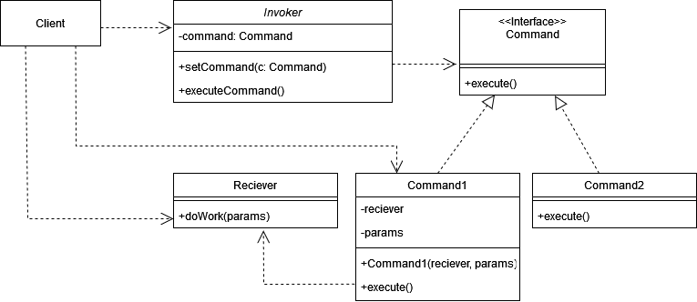
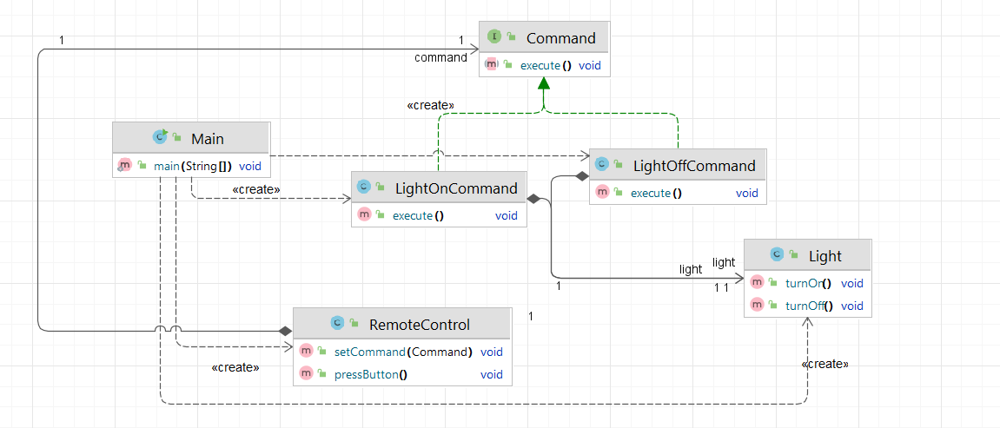

# Команда (Command)

**Команда** - это поведенчский паттерн проектирования, который позволяет работать с запросами как с объектами, передавая
их в качестве аргументов методов, логировать их, ставить в очередь и поддерживать отмену операций.

Стандартная реализация шаблона включает в себя:

1. Создать интерфейс или абстрактный класс, который определяет метод `execute`,
   используемый для выполнения команды.
2. Реализовать классы, которые наследуются от интерфейса команды, и переопределяют
   метод `execute`, чтобы выполнить конкретные действия.
3. Определить класс, который будет выполнять действия по запросу команд; этот класс
   называется "получатель" (receiver).
4. Передать экземпляр получателя в конкретную команду, чтобы команда знала, какое
   действие нужно выполнить.
5. Реализовать класс, который будет управлять очередью команд и вызывать их в
   нужный момент.
6. Вызвать метод `execute` на командах из вызывающего объекта, чтобы выполнить действия в
   определенном порядке.
7. Если требуется, добавьте поддержку операций `undo` и `redo`, реализовав дополнительные методы в конкретных командах и
   вызывающем объекте.

В общем виде диаграмма шаблона выглядит следующим образом:

## Команда в Java

Обычно команды применяются в приложениях с пользовательским интерфейсом GUI.
В контексте GUI, например, в Swing или AWT, этот интерфейс можно использовать для создания команд, которые выполняются
при возникновении события (например, при нажатии кнопки). Метод `actionPerformed` представляет собой команду, которая
выполняет определенное действие.

## Описание нашего примера

В нашем примере мы создадим аналог умного дома, в котором различные устройства могут быть включены и выключены.
Команда будет инкапсулировать действие включения или выключения устройства.

**Итоговая диаграмма классов**:

