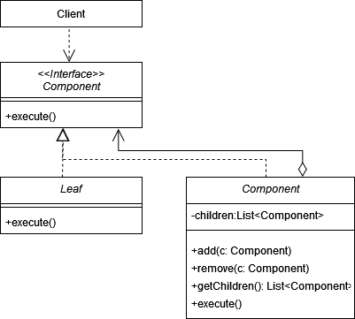
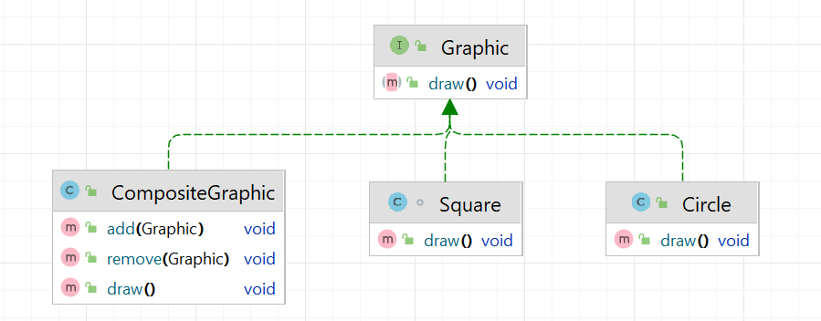

# Компоновщик (Composite)

**Компоновщик** - это структурный паттерн, который позволяет сгруппировать объекты в древовидную структуру, а затем
работать с этой структурой как с единым объектом.

Стандартная реализация шаблона заключается в следующих пунктах:

1. **Определение общей абстракции**: Создать интерфейс или абстрактный класс, который будет использоваться для описания
   общего поведения компонентов.
2. **Создание простых компонентов**: Реализовать несколько конкретных классов, которые будут представлять отдельные
   элементы или узлы в структуре.
3. **Создание компоновщика**: Реализовать класс, который будет содержать список компонентов и реализовать методы для
   добавления, удаления и обработки вложенных компонентов.
4. **Метод обхода компонентов**: Определить способ обхода всех вложенных компонентов в компоновщике.
5. **Добавление методов для операций**: Реализовать методы в компоновщике, которые позволяют выполнять операции над
   каждым компонентом.

Диаграмма паттерна в общем виде:

## Компоновщик в Java

В стандартной библиотеке Java Компоновщик используется в _Swing_. Класс _java.awt.Container_ используется для добавления
графических компонентов в контейнеры и содержит следующие методы:

- **add(Component comp)**: добавляет дочерний компонент в контейнер.
- **remove(Component comp)**: удаляет указанный дочерний компонент из контейнера.
- **getComponentCount()**: возвращает количество компонентов в контейнере.
- **getComponent(int index)**: возвращает компонент по индексу в контейнере.

## Описание нашего примера

В нашем примере опять поработаем с геометрическими фигурами.

**Итоговая диаграмма классов**:

