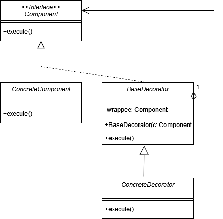
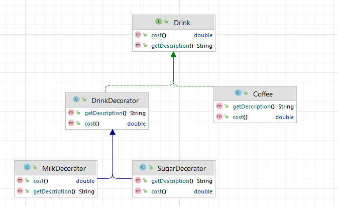

# Декоратор (Wrapper, Decorator)

**Декоратор** - это структурный паттерн, который позволяет оборачивать объекты и добавлять им новую функциональность
налету.

Стандартная реализация шаблона включает в себя:

1. Создать интерфейс, который будет служить базовым для всех декораторов.
2. Создать абстрактный класс-реализацию этого интерфейса, который будет содержать композицию объекта, который нужно
   декорировать.
3. Создать конкретные классы-декораторы, расширяя абстрактный класс из пункта 2 и добавляя свою функциональность.
4. В конкретных классах-декораторах переопределить методы интерфейса и добавить необходимую функциональность.
5. Создать объект декорируемого класса и передать его в декоратор, добавляя по цепочке нужные декораторы.

В общем виде диаграмма шаблона выглядит следующим образом:

## Декоратор в Java

В стандартной библиотеке Java Декоратор можно найти в классах
_java.io.InputStream_ и его подклассах, таких как FilterInputStream и BufferedInputStream. В данном случае, каждый
декоратор расширяет функциональность базового класса InputStream, добавляя свою функциональность.

## Описание нашего примера

В нашем примере есть базовый класс кофе, и мы добавляем к нему различные добавки, используя декораторы.

**Итоговая диаграмма классов**:

