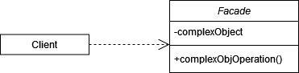
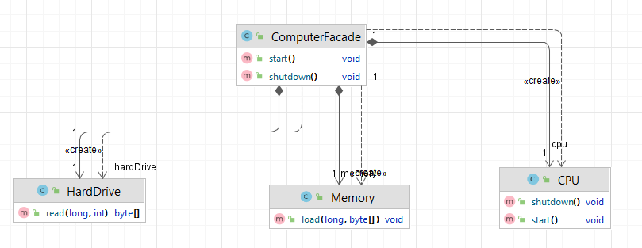

# Facade (Фасад)

**Фасад** - структурны паттерн, который предоставляет интерфейс к сложной системе классов.

Стандартная реализация шаблона включает в себя:

1. Выделить используемые методы в сложной системе или классе.
2. Определить интерфейс, в котором будут указаны методы из первого пункта.
3. Реализовать интерфейс из второго пункта, предоставив клиенту возможность использовать сложную систему или класс.

В общем виде диаграмма шаблона выглядит следующим образом:

## Фасад в Java

Класс _java.util.Arrays_ в пакете действует как фасад для работы с массивами. Он предлагает множество статических
методов для сортировки, поиска, заполнения и других операций, скрывая детали реализации этих методов.

## Описание нашего примера

В нашем примере мы рассмотрим компьютер как сложную систему, при этом у клиента будет простой интерфейс для
взаимодействия с компьютером.

**Итоговая диаграмма классов**:

