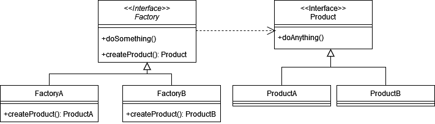
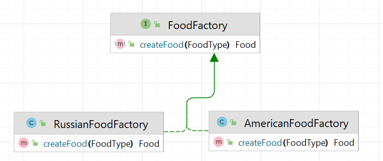
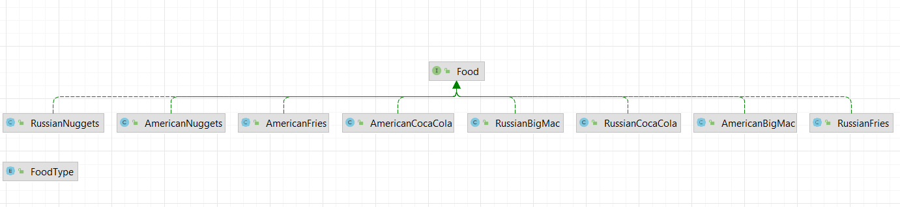

# Фабричный метод (Factory method)

**Фабричный метод** - порождающий паттерн проектирования, который позволяет определить общий интерфейс создания объектов
в суперклассе, при этом подклассы могут самостоятельно определять тип создаваемого объекта.

Стандартная реализация шаблона включает в себя:

1. Определение интерфейса для создаваемых классов
2. Определение реализаций создаваемых классов
3. Определение интерфейса-фабрики
4. Определение реализаций интерфейса-фабрики

В общем виде диаграмма классов для фабричного метода выглядит следующим образом:



## Фабричный метод в Java

В стандартной библиотеке java фабричный метод используется в утилитном классе _Collections_.
Например, методы _Collections.singletonList()_, _Collections.unmodifiableList()_, _Collections.synchronizedList()_
создают объекты на основе контекста.

## Описание нашего примера

В нашем примере мы поработаем с меню в "Макдональдсе". Известно, вкус блюд "Макдональдса" в разных странах отличается,
но называются одинаково. В нашем примере мы попробуем приготовить, т.е. создать экземпляры классов в зависимости от
страны, в которой находимся.

Для этого названия блюд мы вынесем в отдельный Enum:

```java
public enum Food {
    BIG_MAC,
    FRIES,
    COCA_COLA,
    NUGGETS
}
```

Создадим интерфейс для нашей еды:

```java
public interface Food {
}
```

И определим его наследников:

```java
public class AmericanBigMac implements Food {
}

public class AmericanFries implements Food {
}

public class AmericanCocaCola implements Food {
}

public class AmericanNuggets implements Food {
}

public class RussianBigMac implements Food {
}

public class RussianFries implements Food {
}

public class RussianCocaCola implements Food {
}

public class RussianNuggets implements Food {
}
```

Определим интерфейс фабрики:

```java
public interface FoodFactory {
    Food createFood();
}
```

И его реализации _AmericanFoodFactory_, _RussianFoodFactory_.

В итоге получаем вот такую диаграмму классов, которая соответствует той, что была показана вначале.



