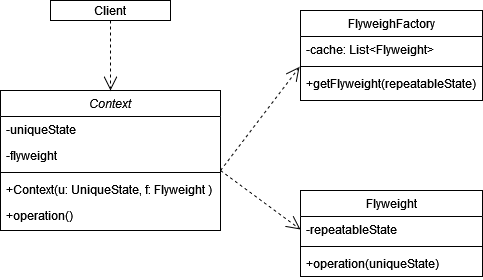
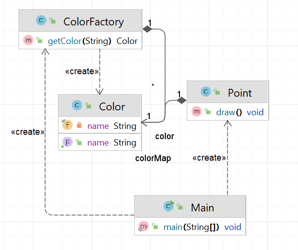

# Легковес (Flyweight)

**Легковес** - структурный паттерн, позволяющий экономить ресурсы за счёт разделения состояния объекта на изменяемое и
неизменяемое.

Стандартная реализация шаблона включает в себя:

1. Выделить в программе объекты, которые занимают много памяти.
2. Разделить состояние объектов на изменяемое и неизменяемое.
3. Неизменяемое состояние можно разделить между несколькими объектами.
4. Изменяемое состояние зависит от контекста, его нужно передавать в метод объекта, в котором используется это
   состояние.

В общем виде диаграмма шаблона выглядит следующим образом:

## Легковес в Java

Самый распространённый пример Легковеса в java - метод _Integer.valueOf()_, который кэшиурет значения от -128 до 127.
Дело в том, что если каждый раз при создании Integer объекта для одного и того же значения выделять новую память, это
приведет к лишнему потреблению памяти. Кэшируя объекты, Java может использовать один и тот же объект для одинаковых
значений, что уменьшает общее использование памяти.

## Описание нашего примера

В нашем примере мы реализуем типичный пример из мира компьютерных игр. У нас будет класс _Точка_, которая имеет
изменяемые состояния _x_ и _y_, а также неизменяемое - _Цвет_.

**Итоговая диаграмма классов**:

