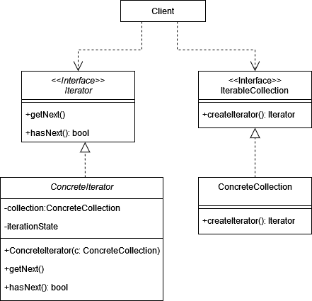
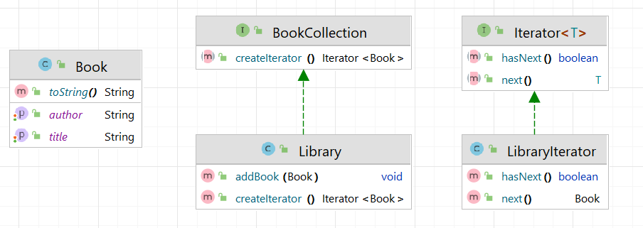

# Итератор (Iterator)

**Итератор** - поведенческий паттерн проектирования, который позволяет обходить коллекцию объектов, не раскрывая их
внутреннего поведения.

Стандартная реализация шаблона включает в себя:

1. Создать структуру данных, которую мы будем итерировать, например, список или массив.

2. Определить интерфейс с методами, которые будут использоваться для итерации. Например, `hasNext()` и `next()`.

3. Создать класс, который реализует интерфейс Итератора, и добавить логику для перемещения по коллекции, используя
   внутренние структуры данных.

4. В классе коллекции добавить метод, который возвращает экземпляр итератора, обычно это `createIterator()`
   или `iterator()`.

В общем виде диаграмма шаблона выглядит следующим образом:

## Итератор в Java

В java есть базовый интерфейс итераторов - `java.util.Iterator`. Его реализуют многие классы коллекций, такие как
ArrayList, HashSet, LinkedList и другие. Он предоставляет методы hasNext() и next(), позволяющие последовательно
обходить элементы коллекции.

## Описание нашего примера

В нашем примере будет коллекция, представляющая список книг, и итератор, который позволяет обходить эти книги.

**Итоговая диаграмма классов**:
