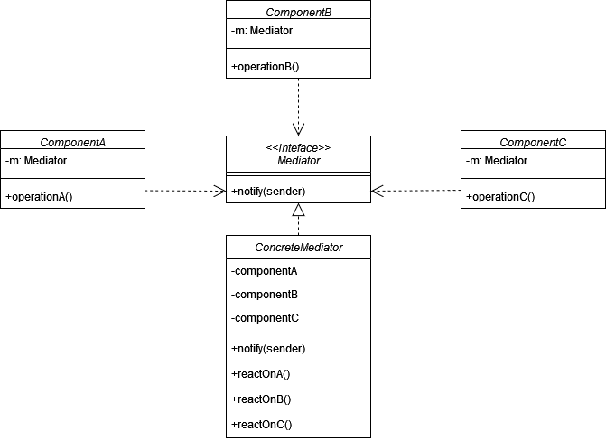
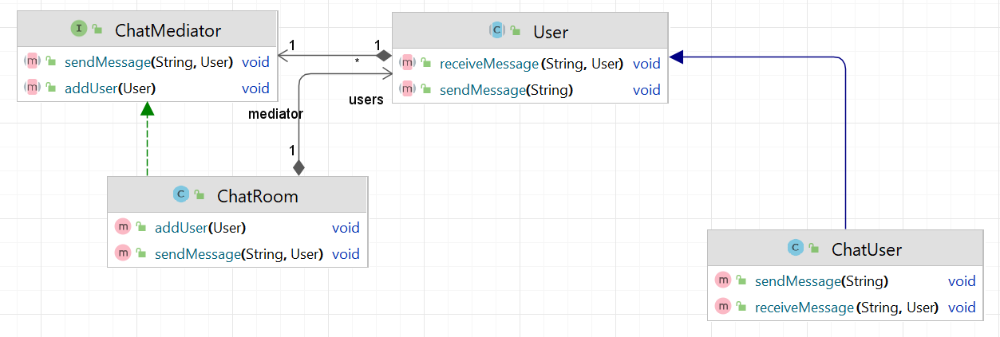

# Медиатор (Mediator)

**Медиатор** - это поведенческий паттерн проектирования, который позволяет уменьшить связанность объектов между собой
путём вынесения их общих зависимостей в отдельный класс.

Стандартная реализация шаблона включает в себя:

1. Определить интерфейс или абстрактный класс, который будет описывать основные функции взаимодействия между
   компонентами.

2. Определить классы или компоненты, которые будут взаимодействовать через медиатор.

3. Создайть класс, который реализует интерфейс Медиатора, и написать логику координации взаимодействия между
   участниками.

4. Обеспечить способ добавления участников к Медиатору и их регистрацию в нем. Обычно в Медиаторе есть поля, которые
   являются объектами взаимодействующих дуг с другом классов.

5. Реализовать механизм, позволяющий участникам взаимодействовать друг с другом только через Медиатор, а не напрямую.

6. Если требуется, добавить в Медиатор сложную логику или бизнес-правила, чтобы упростить взаимодействие между
   участниками.

В общем виде диаграмма шаблона выглядит следующим образом:

## Медиатор в Java

В `java.util.logging.Logger` логгер координирует отправку сообщений о логировании к разным хэндлерам. Это помогает
декомпозировать задачи логирования и обеспечивает централизованное управление потоками данных для журналирования.

## Описание нашего примера

Приведу пример реализации паттерна Медиатор в контексте простого чат-приложения. Медиатор будет координировать
отправку сообщений между пользователями.

**Итоговая диаграмма классов**:

