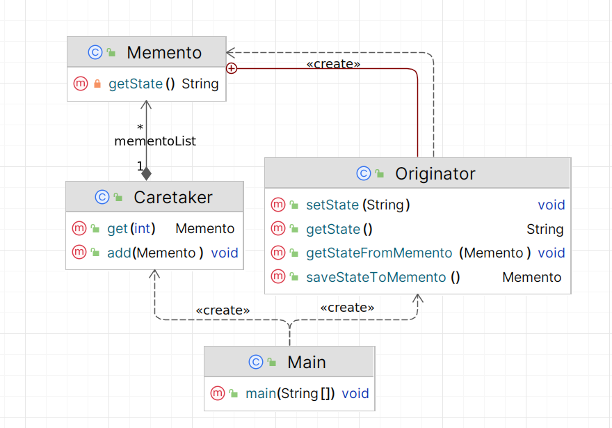

# Снимок (Momento)

**Снимок** - поведенческий паттерн проектирования, который позволяет сохранять и восстанавливать состояния объектов, не
раскрывая их внутренней реализации.

Стандартная реализация шаблона включает в себя:

1. **Определить класс Originator** – создать класс, состояние которого нужно сохранить и восстановить.
2. **Создать внутренний класс Memento внутри Originator** – этот класс будет содержать состояние Originator и
   предоставлять методы для его получения.
3. **Реализовать метод saveStateToMemento в Originator** – создать метод, который будет создавать и возвращать объект
   Memento с текущим состоянием Originator.
4. **Реализовать метод getStateFromMemento в Originator** – создать метод, который будет принимать объект Memento и
   восстанавливать состояние Originator из него.
5. **Определить класс Caretaker** – создать класс, который будет управлять объектами Memento, сохраняя и предоставляя их
   по запросу.
6. **Добавить в Caretaker коллекцию для хранения объектов Memento** – использовать, например, ArrayList для хранения
   последовательности состояний.
7. **Реализовать методы add и get в Caretaker** – создать метод add для добавления нового объекта Memento в коллекцию и
   метод get для возврата Memento по индексу.
8. **В клиентском коде создать объекты Originator и Caretaker** – создать экземпляры этих классов для взаимодействия.
9. **Сохранять состояние Originator через Memento и Caretaker** – изменять состояние Originator и сохранять его в
   Caretaker с помощью метода saveStateToMemento.
10. **Восстанавливать состояние Originator из Memento через Caretaker** – использовать метод get в Caretaker и метод
    getStateFromMemento в Originator для восстановления состояния.

В общем виде диаграмма шаблона выглядит следующим образом:

## Снимок в Java

В стандартной библиотеке Java паттерн Memento напрямую не реализован, но его концепция используется в некоторых классах
для сохранения и восстановления состояния объектов. Например, класс `java.util.Stack`можно использовать для реализации
undo/redo функциональности, сохраняя состояние объектов в стеке.

## Описание нашего примера

Сделаем стандартную реализацию Momento с внутренним классом.

**Итоговая диаграмма классов**:

