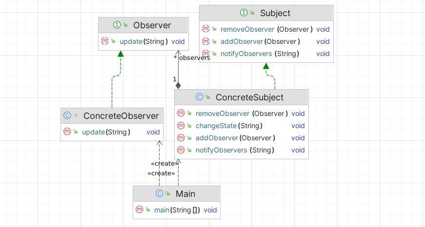

# Наблюдатель (Observer)

**Наблюдатель** - поведенческий паттерн проектирования, который позволяет одним объектам подписываться на другие и
реагировать на события, которые происходят в объектах-издателх.

Стандартная реализация шаблона включает в себя:

1. **Определить интерфейс Observer** – создать интерфейс с методом обновления, который будет вызываться субъектом для уведомления наблюдателей.
2. **Определить интерфейс Subject** – создать интерфейс с методами для добавления, удаления и уведомления наблюдателей.
3. **Создать конкретный класс Subject** – реализовать интерфейс Subject и хранить список наблюдателей.
4. **Реализовать методы добавления и удаления наблюдателей в классе Subject** – методы должны добавлять и удалять наблюдателей из списка.
5. **Реализовать метод уведомления наблюдателей в классе Subject** – метод должен проходить по списку наблюдателей и вызывать их метод обновления.
6. **Создать конкретный класс Observer** – реализовать интерфейс Observer и определить метод обновления, который будет получать уведомления от субъекта.
7. **Создать методы для изменения состояния в классе Subject** – методы должны изменять состояние субъекта и вызывать метод уведомления наблюдателей.
8. **В клиентском коде создать объекты Subject и Observer** – добавить наблюдателей к субъекту и изменить состояние субъекта, чтобы увидеть уведомления наблюдателей.

В общем виде диаграмма шаблона выглядит следующим образом:

## Наблюдатель в Java

В стандартной библиотеке Java паттерн Observer реализован с помощью следующих классов:
1. Интерфейс `java.util.Observer` – представляет наблюдателя.
2. Класс `java.util.Observable` – представляет наблюдаемый объект.

Также стандартным примером паттерна издатель-подписчик являются брокеры сообщений.

## Описание нашего примера

Сделаем стандартную реализацию Observer.

**Итоговая диаграмма классов**:

