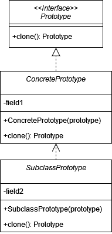

# Прототип (Prototype)

**Прототип** - это порождающий шаблон проектирования, позволяющий копировать объекты не привязываясь к ним и не вдаваясь
в их реализацию.

Стандартная реализация шаблона включает в себя:

В общем виде диаграмма шаблона выглядит следующим образом:

## Прототип в Java

В стандартной библиотеке Java нет явных классов, которые явно называют "Прототип", однако есть интерфейс _Cloneable_ и
метод _clone()_.
Интерфейс _Cloneable_ указывает, что класс поддерживает клонирование, а метод clone() позволяет создать копию объекта.

## Описание нашего примера

В нашем примере реализуем стандартную версию шаблона Прототип.

Однако есть модифицированная реализация шаблона с использованием _хранилища прототипов_. Основная идея заключается в
том, что у нас есть коллекция или отдельный класс, в котором хранятся объекты. И мы можем каждый раз не создавать копию
объекта, а выбирать уже склонированные объекты по какому-либо признаку. Например, по id или значению любого другого
поля.

**Итоговая диаграмма классов**:

