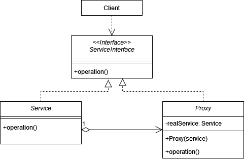
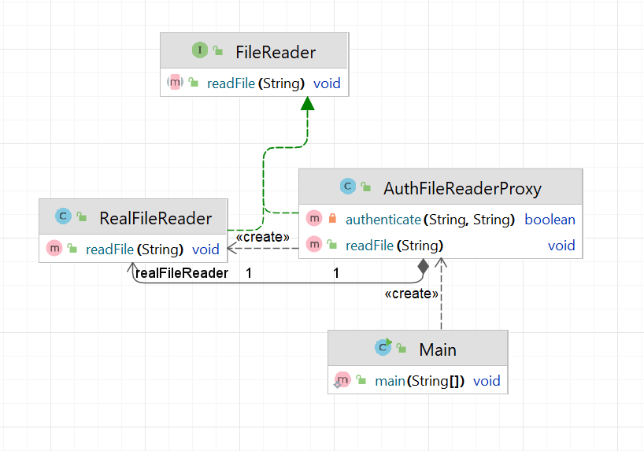

# Заместитель (Proxy)

**Заместитель** - это структурный паттерн, который позволяет реализовать класс, перехватывающий вызовы методов другого
класса, чтобы выполнять какие-либо операции до или после вызова целевого метода.

Стандартная реализация шаблона включает в себя:

1. Описать интерфейс или абстрактный класс, который будет представлять
   функциональность целевого объекта.
2. Реализовать целевой объект, который содержит фактическую бизнес-логику.
3. Описать класс, который реализует интерфейс целевого объекта и делегирует вызовы
   реальному объекту.
4. Определить дополнительные функции, такие как кэширование, контроль доступа
   или логирование, которые будут выполняться прокси перед передачей вызова реальному объекту.
5. Если необходимо, создать фабрику или систему управления, чтобы создавать
   и управлять экземплярами прокси.

В общем виде диаграмма шаблона выглядит следующим образом:

## Заместитель в Java

Самым ярким примером Заместителя будет являться класс _java.lang.reflect.Proxy_.
Он позволяет динамически создавать классы-прокси во время выполнения. Этот механизм используется для различных целей,
таких как создание прокси-объектов для удаленных вызовов (например, RMI) или для создания динамических прокси, которые
могут перехватывать и обрабатывать вызовы методов.

## Описание нашего примера

Мы реализуем стандартный Прокси, который проверяет доступ к ресурсу перед вызовом целевого метода.

**Итоговая диаграмма классов**:

