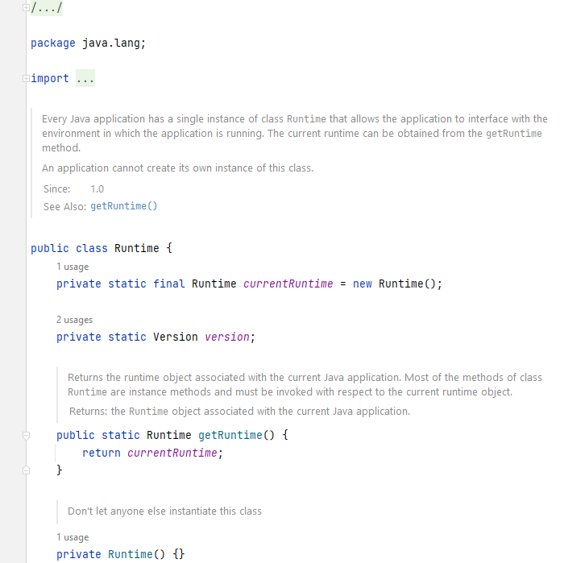

# Singleton (Одиночка)

**Одиночка** - порождающий паттерн проектирования, который гарантирует, что у класса есть только один экземпляр объекта.
К этому экземпляру объекта предоставляется глобальная точка доступа.

Стандартная реализация шаблона заключается в следующих пунктах:

1. **Приватный конструктор**. Ограничивает возможность создания объектов класса за пределами самого класса.
2. **Публичный статический метод**, который возвращает экземпляр класса.


В нашем примере будет класс Database с приватным конструктором и статическим методом _getInstance()_,
а так же метод-заглушка, который эмулирует выполнение SQL-запроса.

## Singleton в Java

Примером использования Одиночки является класс Runtime, который позволяет приложениям взаимодействовать с JRE, например,
чтобы запускать процессы или управлять памятью. Этот класс следует паттерну Singleton, предоставляя статический метод
_getRuntime()_ для получения единственного экземпляра.



## Модификации Singleton

Следует отметить, что в нашем примере реализован модифицированный вариант Одиночки с ленивой инициализацией
(lazy initialization). Он позволяет создавать инстанс класса только по требованию (т.е. только тогда, когда клиент
вызовет метод _getInstance()_). Ленивая инициализация является важным аспектом, особенно когда создание объекта занимает
много времени и/или требует много вычислительных ресурсов.

Эталонный и самый простой вариант выглядит так:

```java
public class Database {
    private static final Database DATABASE = new Database();

    private Database() {
    }

    public static Database getInstance() {
        return DATABASE;
    }
}
```

Однако оба эти варианта не являются потокобезопасными. А что если несколько клиенов захотят одновременно создать
подключение к базе данных? Можно засинхронизировать метод _getInstance()_:

```java
public class Database {

    private static Database DATABASE;

    private Database() {
    }

    public static synchronized Database getInstance() {
        if (DATABASE == null) {
            DATABASE = new Database();
        }
        return DATABASE;
    }
}
```

Однако при такой реализации мы сильно теряем в производительности, ведь у нас засинхронизирован целый метод.

Решить эту проблему можно использованием механизма **Double Check Locking**. Его суть заключается в следующем:

1. **Проверка без блокировки**: В начале, выполняется проверка без блокировки, чтобы увидеть, был объект
   инициализирован или нет. Если объект уже существует, мы возвращаем его.
2. **Синхронизация**: Если объект не инициализирован, происходит синхронизация по блокировке (обычно, с использованием
   synchronized или других примитивов синхронизации). Это гарантирует, что только один поток может инициализировать
   объект одновременно.
3. **Повторная проверка с блокировкой**: После входа в блокировку проводится еще одна проверка, чтобы убедиться, что
   объект все еще не инициализирован (возможно, другой поток уже сделал это между первой проверкой и блокировкой).
4. **Инициализация объекта**: Создаем объект, если он ещё не был создан и возвращаем его.

```java
public final class Database {

    private static volatile Database DATABASE;

    private Database() {
    }

    public static Database getInstance() {
        Database result = DATABASE;
        if (result != null) {
            return result;
        }
        synchronized (Database.class) {
            if (instance == null) {
                instance = new Database();
            }
            return instance;
        }
    }
}
```

Мы рассмотрели самые популярные реализации Singleton, однако их существует целое множество. Но все нерассмотренные
реализации можно найти на просторах интернета =)