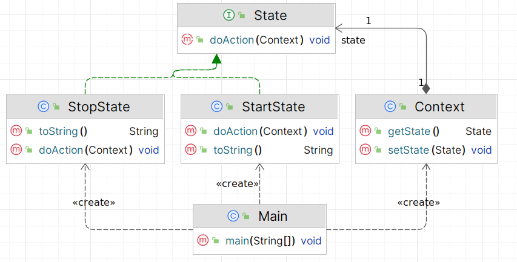

# Состояние (State)

**Состояние** - поведенческий паттерн проектирования, который даёт объектам возможность менять своё поведение в
зависимости от внутреннего состояния.

Стандартная реализация шаблона включает в себя:

1. **Определить интерфейс State** – создать интерфейс, который будет содержать методы, соответствующие различным
   действиям объекта в разных состояниях.
2. **Создать конкретные классы состояния** – реализовать интерфейс State в нескольких классах, каждый из которых будет
   представлять конкретное состояние и содержать соответствующие реализации методов.
3. **Определить класс Context** – создать класс, который будет содержать текущее состояние и предоставлять методы для
   изменения состояния.
4. **Добавить поле состояния в класс Context** – добавить в класс Context поле, которое будет хранить текущее состояние.
5. **Реализовать методы для изменения состояния в классе Context** – создать методы, которые будут изменять текущее
   состояние объекта Context.
6. **В методах класса Context делегировать выполнение действий текущему состоянию** – реализовать методы, которые будут
   вызывать соответствующие методы текущего состояния.
7. **В клиентском коде создать объект Context** – создать экземпляр класса Context и установить его начальное состояние.
8. **Вызвать методы объекта Context для выполнения действий** – использовать методы объекта Context, чтобы увидеть, как
   поведение меняется в зависимости от состояния.

В общем виде диаграмма шаблона выглядит следующим образом:

## Состояние в Java

Класс `java.lang.Thread` имеет различные состояния, такие как `NEW`, `RUNNABLE`, `BLOCKED`, `WAITING`, `TIMED_WAITING` и
TERMINATED. Хотя здесь нет явной реализации паттерна State, концепция различных состояний и изменение поведения в
зависимости от текущего состояния присутствует

## Описание нашего примера

В нашем примере покажем, как объект `Context` изменяет своё поведение в зависимости от текущего состояния, используя
паттерн `State`.

**Итоговая диаграмма классов**:

