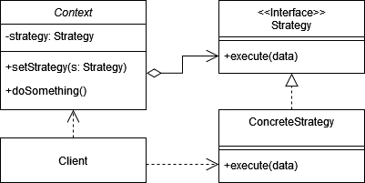
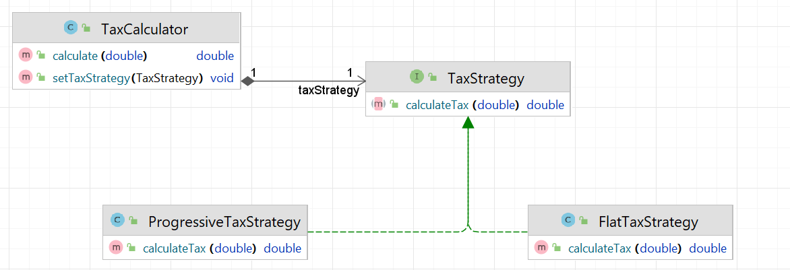

# Стратегия (Strategy)

**Стратегия** - это поведенчески паттерн программирования, который позволяет определить несколько алгоритмов. Эти
алгоритмы можно заменять друг другом в ходе работы программы.

Стандартная реализация шаблона включает в себя:

1. Выделить основной класс или компонент, который будет использовать стратегию для выбора поведения или алгоритма.

2. Определить интерфейс или абстрактный класс, который определяет методы, представляющие разные стратегии.

3. Реализовать несколько классов, которые наследуются от интерфейса Стратегии и предоставляют конкретные реализации
   поведения или алгоритма.

4. Добавить в основной класс ссылку на объект стратегии и метод для установки желаемой стратегии.

В общем виде диаграмма шаблона выглядит следующим образом:

## Стратегия в Java

В классе `java.util.Collections` есть метод `sort(List<T> list, Comparator<? super T> c)`, где `Comparator` выступает в
роли стратегии. Мы можем задать разные стратегии сортировки, реализовав интерфейс `Comparator`, и передать их в метод
`sort` для того чтобы выполнить сортировку по выбранной стратегии.

## Описание нашего примера

В нашем примере поработаем с различными стратегиями расчёта налогов.

**Итоговая диаграмма классов**:

