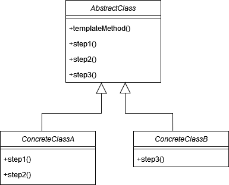
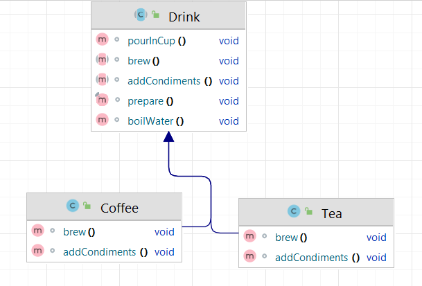

# Шаблонный метод (Template Method)

**Шаблонный метод** - поведенческий паттерн проектирования, который позволяет определить шаблонную реализацию некоторого
алгоритма, при этом за некоторые шаги в этом алгоритме отвечают подклассы. Паттерн позволяет конкретным подклассам
переопределить реализацию алгоритма, не изменяя его общей структуры.

Стандартная реализация шаблона включает в себя:

1. Определить общий процесс, который нужно реализовать в методе, состоящий из нескольких шагов.

2. Создать базовый класс, который будет содержать шаблонный метод и абстрактные или пустые методы для шагов процесса.

3. В базовом классе реализовать метод, который определяет общий алгоритм, вызывая необходимые шаги в нужном порядке.

4. В базовом классе объявить абстрактные методы для шагов процесса, которые будут реализованы в подклассах.

5. Определить конкретные классы, которые будут наследовать базовый класс и реализовывать абстрактные методы, чтобы
   обеспечить конкретное поведение.

6. В каждом подклассе реализовать абстрактные методы, определенные в базовом классе, чтобы предоставить конкретные
   реализации шагов процесса.

В общем виде диаграмма шаблона выглядит следующим образом:

## Шаблонный метод в Java

Класс `java.util.AbstractList` определяет общую структуру для списка, а подклассы, такие как `ArrayList` и `LinkedList`,
реализуют конкретные методы, такие как `get(int index)` и `size()`. Шаблонный метод `add()` определяет общий алгоритм
добавления элементов, а подклассы могут переопределить конкретные шаги.

## Описание нашего примера

В нашем примере рассмотрим приготовление напитка по шагам.

**Итоговая диаграмма классов**:

