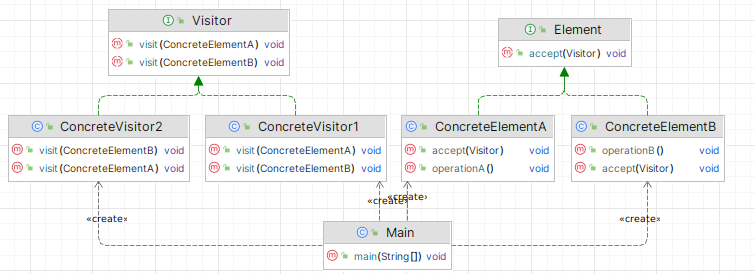

# Посетитель (Visitor)

**Посетитель** - поведенческий шаблон проектирования, который позволяет выполнять над объектами различные операции, не
изменяя классы объектов, над которыми эти операции выполняются.

Стандартная реализация шаблона включает в себя:

1. **Определить интерфейс Visitor** – создать интерфейс с методами visit для каждого типа элемента, который может
   принять посетителя.
2. **Определить интерфейс Element** – создать интерфейс с методом accept, который будет принимать объект Visitor.
3. **Создать конкретные классы элементов** – реализовать интерфейс Element в нескольких классах, каждый из которых
   представляет конкретный элемент.
4. **Реализовать метод accept в каждом конкретном классе элемента** – метод должен принимать объект Visitor и вызывать
   его метод visit, передавая себя в качестве аргумента.
5. **Создать конкретные классы посетителей** – реализовать интерфейс Visitor в нескольких классах, каждый из которых
   будет предоставлять конкретную реализацию методов visit для различных типов элементов.
6. **Добавить дополнительные методы в интерфейс Visitor, если необходимо** – добавить дополнительные методы visit для
   новых типов элементов, если это потребуется.
7. **В клиентском коде создать объекты элементов и посетителей** – создать экземпляры элементов и посетителей для
   взаимодействия.
8. **Использовать метод accept для каждого элемента** – вызывать метод accept у каждого элемента, передавая объект
   Visitor для выполнения операции.

В общем виде диаграмма шаблона выглядит следующим образом:

## Посетитель в Java

Механизм рефлексии в Java позволяет выполнять операции над объектами и их структурами (методы, поля и конструкторы) без
изменения их классов. Методы, такие как `Method.invoke()`, позволяют выполнить метод объекта без необходимости явно
вызывать его.

## Описание нашего примера

В нашем примере приведём стандартную реализацию Посетителя.

**Итоговая диаграмма классов**:

